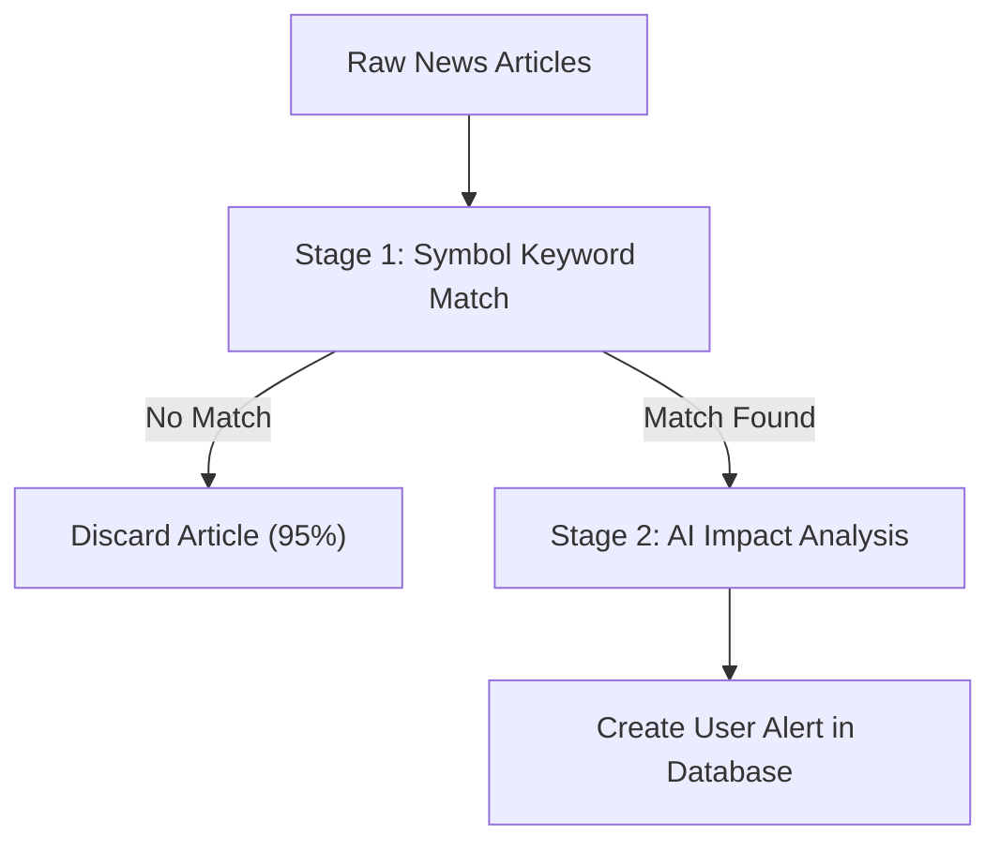

# 📄 FinSage — Product Requirements Document

| Field | Detail |
|---|---|
| **Status** | ✅ Approved / 🚀 Shipped |
| **Author** | GAURAV KUMAR |
| **Last Updated** | 2026-06-16 |
| **Document Owner** | Product Manager |
| **Stakeholders** | Engineering Lead, Design Lead, QA Lead, Data & Analytics |
| **Target Release** | Phase 10 Completed (June 2026) |

> **Executive Summary**: FinSage is an AI-powered portfolio intelligence platform tailored for Indian retail investors holding NSE/BSE stocks and cryptocurrencies. It aggregates news, filters out noise by matching articles against a user's specific assets, and uses artificial intelligence to generate personalized, easy-to-understand alerts. It aims to eliminate information overload by keeping investors informed of only what truly impacts their wealth.

---

## 1. Overview & Context

### 1.1 Problem Statement
Retail investors face **information overload**. They hold multiple stocks and digital currencies (cryptos), and are bombarded by hundreds of news articles every day from money portals, newspapers, and online forums. 
* Sorting through these articles to find the ones that actually affect their holdings takes hours.
* Investors often miss critical, high-impact events (such as regulatory warnings or major earnings reports) because they are buried under generalized market summaries.
* Typing out portfolio details (asset name, quantity, purchase price) to set up tracking on manual tools is tedious and leads to abandonment.

### 1.2 Background & Strategic Fit
FinSage fits into the personal finance category as a **signal filter** and **intelligent assistant**. 
* **The Rule of Boundaries**: FinSage is **not** a trading platform (it does not execute buy/sell orders), **not** a financial advisor (it does not tell users what to buy), and **not** a stock predictor.
* Instead, it is a monitoring and alert-generating companion. By helping users cut through noise, it acts as a central workspace that saves time and gives peace of mind.

### 1.3 Evidence & Insights
* Industry studies show that the average retail investor checks their portfolio tracking app multiple times a day out of anxiety rather than a need to trade.
* Over 95% of daily stock market articles are generic market recaps (such as "Nifty closes higher") or irrelevant to an individual’s specific holdings. 
* By matching news articles directly with the user's holdings first, we can discard 95% of the articles before analyzing them, keeping computing costs near zero.

---

## 2. Goals & Success Metrics

### 2.1 Goals
* **Automate Ingestion**: Allow users to instantly import their holdings by uploading a screenshot of their broker terminal.
* **Reduce News Noise**: Filter out generic news and only present events that directly match a user's holdings.
* **Deliver Plain-Language Alerts**: Summarize complex financial events into short, 2-sentence explanations of "Why it matters" and "What the impact is."
* **Provide an AI Assistant**: Offer a conversational chatbot that can answer immediate questions about the user's specific portfolio performance and recent news.
* **Deliver Digests**: Automatically email consolidated summaries of news to users daily or in real-time for high-severity issues.

### 2.2 Non-Goals
* **No Trading Capabilities**: Users cannot buy or sell stocks/cryptos inside FinSage.
* **No Financial Recommendations**: FinSage will never say "You should buy stock X."
* **No Broker Integrations**: Rather than linking brokerage accounts (which introduces security risks and friction), the app uses screenshots or simple manual entry.
* **Not a Mutual Fund Tracker**: Net Asset Value (NAV) price data is not fetched. Mutual fund holdings can be manually added to track holdings quantities, but live pricing updates are not supported.

### 2.3 Success Metrics

To measure the product's success, we categorize our metrics into three types:
1. **North Star Metric (NSM)**: The single key metric that captures the primary value our product delivers to our users.
2. **Primary Metrics**: Core metrics measuring the effectiveness and accuracy of specific features.
3. **Guardrail Metrics**: Safety metrics to ensure that performance, user satisfaction, or system reliability do not decrease as we launch new features.

Additionally:
* **Baseline**: The starting point or current value of the metric *before* implementing these features.
* **Target**: The desired value we want to achieve *after* launching the features.

| Metric | Type | Baseline (Before launch) | Target (Goal) | How Measured |
|---|---|---|---|---|
| **News Noise Reduction Rate** | North Star Metric (NSM) | 0% (All incoming articles shown to user) | > 95% reduction in news volume | Ratio of generic scraped articles discarded vs. alerts created |
| **Alert Relevance Rate** | Primary Metric | N/A (No alerts system exists) | > 90% user relevance approval | User feedback on alerts (e.g., thumbs up/down or clicks) |
| **Chatbot Response Accuracy** | Primary Metric | N/A (No chatbot exists) | > 95% accurate responses | Daily review of flagged chatbot answers and user correction logs |
| **Portfolio Entry Time** | Primary Metric | 3 minutes (Manual typing) | < 30 seconds (Screenshot upload) | Automated timer from upload click to editable list load |
| **Email Alert Unsubscribe Rate** | Guardrail Metric | 0% (No emails sent yet) | < 2% unsubscribe rate | Resend/email service unsubscribe event tracking |
| **API Response Latency** | Guardrail Metric | N/A | < 1.5 seconds p95 load time | Server-side performance telemetry |

---

## 3. Users & Use Cases

### 3.1 Target Users / Personas

#### Primary — The Self-Directed Indian Retail Investor
* **Profile**: Age 20-40, digitally native, holds 5-15 stocks on NSE/BSE plus some cryptocurrency assets.
* **Broker tools**: Uses modern trading apps like Zerodha, Groww, Upstox, or Angel One as their primary broker.
* **Information Sources**: Reads financial portals like ET Markets, MoneyControl, or CoinDesk but finds the sheer amount of daily articles overwhelming.
* **Resource Gap**: Does not have access to institutional research or premium financial terminals; relies heavily on YouTube, Twitter, and community forums for investment ideas.
* **Primary Pain Point**: Spends 30-50 minutes every day manually checking websites and search engines to see if any news affects their specific holdings.

#### Secondary — The Passive Long-Term Investor
* **Profile**: Casual investors who check their portfolios weekly or monthly but want to be immediately notified via email or dashboard alerts if a high-severity event (such as a major regulatory shift or company fraud) occurs.

### 3.2 User Stories
* **US-1 (Ingestion)**: As a retail investor, I want to upload a screenshot of my brokerage app, so that my stocks and quantity are automatically added to my dashboard without typing them.
* **US-2 (News & Alerts)**: As a retail investor, I want to receive dashboard and email alerts for high-severity news affecting my specific holdings, with each alert explaining why the event matters in plain English, so that I can make informed decisions quickly without being overwhelmed by market noise.
* **US-3 (Portfolio Management)**: As a retail investor, I want to see live prices and P&L for all my holdings in one view, so that I don't have to check each broker app separately.
* **US-4 (Watchlist - Tracking)**: As a retail investor, I want to track assets I'm considering buying without adding them to my portfolio, so that I can monitor them before committing capital.
* **US-5 (Watchlist - Move)**: As a retail investor, I want to move a watchlist item to my portfolio with a few taps when I buy it, so that portfolio management stays frictionless.
* **US-6 (AI Assistant / Chat)**: As a retail investor, I want to ask an AI chatbot "How are my holdings performing today?" so that I can get a quick summary of my live profits and recent news in plain words.

### 3.3 Key Use Cases / Scenarios

#### Scenario 1 — First-Time Portfolio Setup
User opens FinSage, signs up with email, lands on upload page. Takes a screenshot of their Zerodha portfolio app. Drags it into the upload zone. Gemini Vision extracts holdings into an editable table showing symbol, quantity, avg buy price. User corrects one wrong ticker. Clicks Confirm. Dashboard loads with live prices showing total portfolio value, P&L, allocation chart.

#### Scenario 2 — Morning Alert Review
User wakes up, sees email from FinSage: "High Impact Alert: INFY Q4 earnings miss." Opens the app, goes to Alerts. Sees the alert card showing: High severity, INFY badge, news headline, AI explanation "Infosys missed Q4 revenue estimates by 3.2%, guidance cut for FY25. Your 50 shares are down approximately ₹8,500 in pre-market. Analysts may downgrade — watch for opening price action." User marks as read, opens news source to read full article.

#### Scenario 3 — Chatbot Portfolio Q&A
User opens chatbot, types "How is my portfolio doing today vs yesterday?" Chatbot fetches live prices, computes day P&L, cross-references with yesterday's close, responds: "Your portfolio is up ₹1,077 (+1.94%) today. INFY is your biggest drag (-0.8%) while RELIANCE is contributing the most gains (+2.1%). BTC is flat."

#### Scenario 4 — Edge Case: OCR Failure
User uploads a low-resolution screenshot. Gemini Vision extracts 3 of 6 holdings correctly, misses 3. Review table shows only 3 rows. User notices, clicks "Add holdings manually" for the remaining 3. Enters them via the form. Confirms. Dashboard shows all 6 holdings.

---

## 4. Requirements

### 4.1 Functional Requirements

| ID | Requirement | Priority | User Story Ref | Notes |
|---|---|---|---|---|
| **FR-1** | Screenshot Upload & Extraction (OCR) | P0 | US-1 | Allow drag-and-drop or file upload of portfolio screenshots. Gemini Vision extracts ticker symbols, names, quantities, and average buy prices into an editable table in memory. No files are saved to Cloud Storage. |
| **FR-2** | Manual Holdings Entry | P1 | US-1 | Provide a fallback search and form interface allowing users to manually enter asset details (symbol, name, quantity, average buy price). |
| **FR-3** | Live Price Ingestion & P&L Calculation | P0 | US-3 | Fetch real-time price updates (Yahoo Finance for Indian stocks, CoinGecko for cryptos) with a 60-second in-memory cache to calculate live portfolio valuation, total P&L, day change, and asset allocations. |
| **FR-4** | Interactive Portfolio Dashboard | P0 | US-3 | Render metrics cards (invested value, current value, return %, best/worst performer), an asset allocation donut chart, and a 30-day performance area chart. |
| **FR-5** | Watchlist Management | P2 | US-4 | Enable tracking of assets (stocks, cryptos) without buying, displaying live price and performance data. |
| **FR-6** | Watchlist-to-Portfolio Transition | P2 | US-5 | Support transitioning a watched asset directly into portfolio holdings by prompting for quantity and average buy price. |
| **FR-7** | Two-Stage News Noise Filtering | P0 | US-2 | **Stage 1 (Keyword Match)**: Match incoming RSS/NewsAPI/Reddit articles against active user holdings, dropping articles with no matches (~95%). **Stage 2 (AI Analysis)**: Send matches to Gemini for impact severity analysis and personalized alert generation. |
| **FR-8** | Collapsible Dashboard Alerts | P2 | US-2 | Display active/unread and read/dismissed alerts grouped by holding symbol. Show AI-generated explanations ("Why it matters") and let users mark as read or dismiss. |
| **FR-9** | Email Alerts & Daily Digests | P0 | US-2 | Send real-time email notifications for high-severity alerts and daily consolidated digests (9:00 AM, 3:00 PM, 11:00 PM IST) based on user settings, utilizing the Gmail MCP tool. |
| **FR-10** | Floating AI Chatbot Assistant | P0 | US-6 | A floating conversational assistant with mascot customization that uses RAG to access the user's holdings, portfolio performance, and recent news/alerts to answer queries. Logs a rolling limit of 25 messages per user. |
| **FR-11** | User Profile & Preference Settings | P1 | US-3, US-2 | Manage display name, base currency preference (INR/USD), and configure notification thresholds, along with a secure "Danger Zone" to delete holdings. |

### 4.2 Non-Functional Requirements

| Category | Requirement | Description |
|---|---|---|
| **Performance** | Load Time < 1.5s | The dashboard page must render fully in under 1.5 seconds under normal connection speeds. |
| **Security & Privacy** | Private Image Processing | Uploaded screenshots are processed in memory to extract text and are **never saved** on disk or cloud storage to protect user privacy. |
| **User Interface** | Geist Font & Theme | Dark mode aesthetic using Geist fonts and dual accents (Gold `#E2B659` and Blue `#1F4E79`). |
| **Localization** | Indian Format Notation | Financial numbers must use the Indian numbering format (e.g., Lakhs and Crores, using the `en-IN` locale system). |
| **Resilience** | API Key Rotation Pools | Configure rotation pools for Groq and Gemini APIs to automatically cycle keys and handle 429 rate limits. |
### 4.3 User Experience & Design

* **Figma Design Link**: [Figma Interactive Prototypes](https://linter-cookie-16465329.figma.site/) — Link to the active Figma design workspace and prototypes.

* **Key Flows & Wireframes**:
  * *First-time Ingestion (OCR)*: Upload Area -> Gemini Vision OCR Parsing (base64 in-memory) -> Editable Correction Table -> Confirmed Dashboard Load.
  * *Alert Interaction*: Feed View -> Collapsible Holding-wise Alert Card -> Detail Explainer -> Mark as Read / Dismiss Action.
  * *Conversational QA*: Mascot Chatbot Toggle -> Contextual prompt -> Multi-Key API routing -> Streaming text response.
* **Design Principles**:
  * *Dark Mode First*: Core interface background `#090D12` and premium workspace panel surfaces `#121820`.
  * *Vibrant Dual Accent*: Dual-accent branding combining gold (`#E2B659` for highlights/active state) and trust blue (`#1F4E79`).
  * *Motion & Feedback*: 300ms page transitions, 60ms card stagger effects, and active state gold-glow border shadows.
* **States Management**:
  * *Loading*: Shimmer skeleton components (`.skeleton`) mirroring the target card and table grid layouts.
  * *Empty*: Informative and clean call-to-actions (e.g., dashboard upload CTA, empty watchlist helper).
  * *Error*: Non-blocking inline warning states (e.g., using estimated pricing fallbacks when the live API fails).
* **Responsive Behavior**:
  * Fluid desktop layouts shifting to a single-column layout on mobile viewports.
  * Collapsible mobile sidebar navigation transitioning to a bottom action drawer or compact topbar layout.
---

## 5. Scope & Phasing

### 5.1 Scope — Shipped Phase-wise

* **Phase 1-3 (Core Dashboard & Ingestion)**:
  * Secure auth shell (Firebase Auth) with session management and Edge middleware guards.
  * Drag-and-drop screenshot OCR parsing (Gemini Vision) extracting tickers, names, and quantities.
  * Landing page, main dashboard overview, Recharts charts, and live holdings table.
* **Phase 4-5 (Alerting Pipeline)**:
  * Ingestion pipeline supporting RSS feeds (MoneyControl, ET, Reuters, CoinDesk), NewsAPI, and Reddit.
  * Cost-saving Two-Stage news filter (string matching tickers -> Gemini analysis for relevance & severity).
  * Personalized, collapsible alerts interface under `/alerts` showing AI reasons.
* **Phase 6-7 (Settings & Watchlist)**:
  * Profile display name and notification preferences selector (currency, threshold, alerts toggles).
  * Watchlist management (live price API wrapper) with transition movement to portfolio.
* **Phase 9-10 (AI Assistant, digests, and email triggers)**:
  * 24/7 floating AI chatbot assistant (Groq Llama-3.3 fallback to Gemini) with RAG context and rolling history.
  * Daily email summaries and alert emails using Gmail MCP tool pipeline.
  * Environment API key rotation pools to prevent 429 rate limit errors.

### 5.2 Future Phases

* **Phase 11 (Mutual Funds & Exchange Rates)**:
  * **Mutual Fund Live Pricing**: AMFI NAV API integration complexity analysis and tracking implementation.
  * **Live USD/INR Exchange Rate**: Integrate live currency conversion into the dashboard (pre-written `exchange-rate.ts` service, integration currently deferred).
* **Phase 12 (Advanced AI Capabilities)**:
  * Predictive sentiment analysis models.
  * Interactive natural-language command system for the chatbot (e.g., "Add 50 shares of TCS bought at ₹3900").

### 5.3 Dependencies

| Dependency | Owner | Status | Risk if Delayed |
|---|---|---|---|
| **Firebase (Auth + Firestore)** | Google | Live | High — entire data layer |
| **Gemini API (Vision + Flash)** | Google | Live | High — OCR + news analysis |
| **Groq API (Llama-3.3-70b)** | Groq | Live | Medium — chatbot falls back to Gemini |
| **Yahoo Finance (unofficial API)** | Third-party | Live — unofficial | High — no SLA, may break without notice |
| **CoinGecko API** | CoinGecko | Live | Medium — crypto prices only |
| **NewsAPI** | NewsAPI.org | Live | Low — RSS feeds are fallback |
| **Gmail MCP** | Google/MCP | Live | Low — email is supplementary to in-app alerts |
| **Vercel (hosting + cron)** | Vercel | Live | High — hosting and pipeline scheduling |

---

## 6. Solution Detail

### 6.1 Proposed Solution
FinSage operates as a three-layer system:
* **Layer 1 — Portfolio Layer**: User imports holdings via screenshot (Gemini Vision OCR) or manual entry. Holdings are stored per-user in Firestore using a soft-delete pattern. Live prices are fetched on-demand from Yahoo Finance (stocks) and CoinGecko (crypto) with a 60-second server-side cache. Portfolio stats (total value, P&L, allocation) are computed on-read.
* **Layer 2 — Intelligence Pipeline**: GitHub Actions cron scheduler runs every 15 minutes (ingest) and 5 minutes (process). Ingest fetches from 6 RSS feeds and NewsAPI, deduplicates by URL hash, and applies a ticker-dictionary Stage 1 filter (dropping ~95% of articles). Process sends survivors to Gemini for relevance scoring, severity classification, and plain-English impact generation. Results create per-user alerts matching held symbols.

* **Layer 3 — Interaction Layer**: Users interact via the web dashboard, alerts panel, and AI chatbot. The chatbot uses RAG: it fetches live holdings, prices, P&L, news, and the USD/INR rate to inject as system context into Groq (Llama-3.3-70b) with a Gemini fallback. Chat history is capped at a rolling limit of 25 messages per user.

### 6.2 Technical Considerations
* **Server/Client Boundary**: Firebase Admin SDK is strictly server-only. All Firestore reads for auth-protected data go through Server Components or Server Actions. Client components receive only serializable plain objects (Timestamps converted to ISO strings).
* **OCR Privacy**: Screenshots are processed entirely in memory, encoded as base64, and sent to Gemini Vision. They are never written to disk or Firebase Storage.
* **Rate Limit Resilience**: Both Groq and Gemini integrations use comma-separated key pools (`GROQ_API_KEYS`, `GEMINI_API_KEYS`). On a 429 rate limit error, the client wrapper automatically rotates keys and retries.
* **Windows CRLF Handling**: `.env.local` on Windows uses CRLF. A `cleanEnvValue()` parser strips `\r\n` from all env var reads in both server and client Firebase initialization to prevent parsing errors.
* **Yahoo Finance**: Utilizes the unofficial `query2.finance.yahoo.com` API (no authentication required). Indian NSE stocks use a `.NS` suffix, BSE uses `.BO`. Queries use `range=1d` to extract accurate daily changes.
* **Cron Security**: The `CRON_SECRET` env var validation was disabled during dev. It must be re-enabled before multi-user scaling to prevent unauthorized trigger runs.

---

## 7. Risks, Assumptions & Open Questions

### 7.1 Assumptions
* **Screenshot Ingestion**: Retail investors are comfortable taking screenshots of their broker holdings interfaces (Zerodha, Groww, Upstox, Angel One) and uploading them.
* **Gemini Vision Extraction**: Gemini Vision can extract holdings from standard Indian broker screenshots with >80% accuracy.
* **Yahoo Finance API**: The unofficial `query2.finance.yahoo.com` API remains accessible without authentication or rate-limiting at current usage volumes.
* **GitHub Actions Scheduler**: GitHub Actions cron scheduler frequency (every 5-15 minutes) is sufficient for near-real-time news monitoring.
* **User Authentication**: Users are comfortable with standard email/password authentication for a personal finance tracking tool.

### 7.2 Risks & Mitigations

| Risk | Impact | Mitigation |
|---|---|---|
| **AI Hallucination** (AI making up incorrect financial summaries) | High | Enforce strict instruction rules on the AI prompts and restrict the chatbot's answers to only portfolio-related facts. |
| **API Rate Limits** (Exceeding request limits on Yahoo or Gemini APIs) | Medium | Implement an automatic backup rotation pool (switching between multiple API keys) if the primary key gets rate-limited. |
| **Privacy Concerns** | High | Explicitly state on the upload page that screenshots are processed in memory and are never saved on the server. |

### 7.3 Open Questions

| # | Question | Owner | Status |
|---|---|---|---|
| **1** | What is the right retention policy for old news articles in Firestore? | PM/Eng | Open |
| **2** | Should we secure background cron job pipelines (via API keys/secrets) before sharing the app with other users? | Eng | **Blocker** |
| **3** | Is Groq's Llama-3.3-70b reliable enough for financial context, or should Gemini be the primary model? | PM/Eng | Open |
| **4** | What is our backup pricing strategy if the unofficial Yahoo Finance API goes offline? | Eng | Open |
| **5** | Should we enforce a daily limit on OCR screenshot uploads per user to prevent API quota overuse? | PM | Open |

---

## 8. Rollout & Sharing Plan

### 8.1 Sharing Strategy
* **Direct Invite**: The application is deployed privately on Vercel. Access link will be shared directly with 4–5 designated users (friends & family) via direct message.
* **Onboarding Guidance**: Share standard screenshot guidelines directly (Zerodha, Groww, Upstox, Angel One) to ensure smooth OCR parsing.

### 8.2 Operational Support
* **Issue Debugging**: Monitor execution logs directly inside the Vercel dashboard to spot any API key exhaustion or rate limits.
* **Maintenance**: Manually clean up or rotate API keys in Vercel environment variables if rate limits are hit by the user group.

---

## 9. Launch Checklist

- [✓] Application deployed to Vercel
- [✓] Environment variables (`GEMINI_API_KEYS`, `GROQ_API_KEYS`, etc.) configured on Vercel
- [✓] Firestore security rules deployed
- [✓] Email/password signup link verified working
- [✓] Verified OCR parsing with broker screenshot samples
- [✓] Verified RAG chatbot responses and news alerts pipeline
- [✓] App URL shared directly with the 4–5 designated users
- [✓] Core features shipped (portfolio, dashboard, alerts, news, chatbot, watchlist, settings)
- [✓] Mobile responsive navigation

---

## 10. Appendix

### 10.1 Glossary
* **AI (Artificial Intelligence)**: Technology that allows computers to understand, summarize, and answer questions like a human analyst.
* **OCR (Optical Character Recognition)**: The computer technology used to extract text and numbers from uploaded pictures.
* **RAG (Retrieval-Augmented Generation)**: The method of providing the chatbot with the user's live holdings information so its answers are accurate rather than generic guesses.
* **Cron / Scheduler**: An automated background timer that triggers tasks (like fetching news or sending emails) at specific hours.
* **API (Application Programming Interface)**: A code bridge that allows our application to ask another service for data, like live stock prices.
* **Soft Delete**: Setting `deletedAt: Timestamp` instead of removing a Firestore document, preserving data integrity.
* **MCP (Model Context Protocol)**: Used for Gmail send integration.

### 10.2 References & Links
* **Figma Interactive Prototypes**: [Figma Site](https://linter-cookie-16465329.figma.site/)
* **Firebase Console**: [Firebase Console](https://console.firebase.google.com/)
* **Google AI Studio (Gemini Keys)**: [Google AI Studio Console](https://aistudio.google.com/)
* **Groq API Console**: [Groq Console Keys](https://console.groq.com/keys)
* **CoinGecko API**: [CoinGecko Developer Dashboard](https://www.coingecko.com/en/api)
* **Yahoo Finance API**: [Yahoo Finance query2 Endpoint Guide](https://query2.finance.yahoo.com)

### 10.3 Decision Log

| Decision | Rationale | Decided By |
|---|---|---|
| **No Cloud Storage for Images** | Eliminates storage costs and guarantees 100% user privacy by never writing user screenshots to disks. | PM/Eng |
| **Two-Stage News Filter** | Reduces API costs by filtering out 95% of generic news before making expensive AI queries. | PM/Tech Lead |
| **Collapsible Alerts Layout** | Organizes the alerts page by asset category rather than a flat chronological list, making it easier to scan. | PM/Design |
| **Groq Mascot Chatbot with Gemini Fallback** | Selected Llama-3.3-70b-versatile via Groq for high-quality, fast financial assistant reasoning, falling back to Gemini Flash for resilience. | PM/Eng |
| **Gmail MCP for Email Digests & Alerts** | Utilized the Gmail MCP service (gmail_send_message) for automated alert and digest emails to avoid paid third-party email providers for a small private user group. | PM/Eng |

