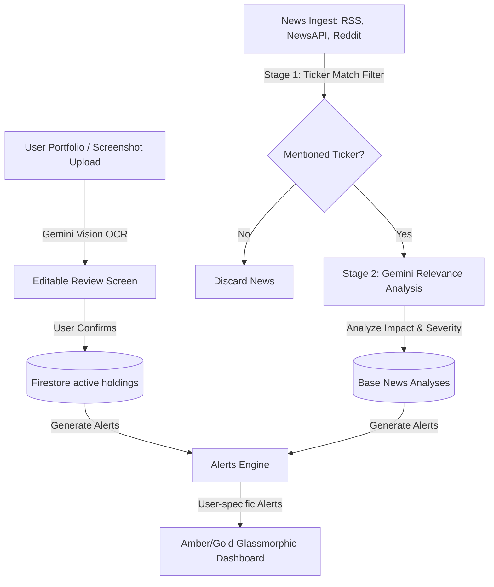

# Problem Statement

## Project Title

**Portfolio Pulse** - AI-Powered Portfolio Intelligence Platform

---

## Problem Overview

Retail investors, particularly in the Indian market, frequently hold a diversified mix of traditional Indian equities (NSE/BSE) and global cryptocurrency assets. However, the information required to monitor these investments effectively is scattered across multiple fragmented platforms: financial news websites, corporate press releases, social media channels, crypto feeds, and macroeconomic reports. 

This fragmentation results in a high-volume stream of noise. A retail investor is bombarded with hundreds of generic market updates every day. Inside this noise, important signals—such as a regulatory change affecting a specific sector, a management shift in a small-cap holding, or a sudden crypto policy update—are easily buried. 

For an individual, it is practically impossible to manually filter this massive influx of news to extract only what is relevant to their specific holdings. A general market index headline might have zero correlation to their portfolio, while an obscure trade announcement could have a massive impact. 

The core challenge Portfolio Pulse addresses is:

> How can modern retail investors stay informed about only the news, market events, and social signals that directly impact their personal portfolio, without being overwhelmed by generic financial noise, and how can they achieve this cost-effectively and securely?

---

## Target Users

Portfolio Pulse is designed for individual retail investors who:

1. **Invest in the Indian Stock Market**: Active participants holding equities on the National Stock Exchange (NSE) or Bombay Stock Exchange (BSE).
2. **Hold Cryptocurrencies**: Track digital assets (e.g., Bitcoin, Ethereum) alongside traditional market holdings in a single unified view.
3. **Suffer from Information Overload**: Seek a filtered, relevant news feed instead of scrolling through generic financial news apps or noisy subreddits.
4. **Require Contextual Explanations**: Want to understand *why* an event matters to their specific portfolio in a few simple, human-readable sentences rather than reading long, complex articles.
5. **Value Privacy & Ownership**: Prefer not to sync their actual brokerage accounts directly and want control over how their portfolio data is uploaded and stored.

---

## Technical Constraints & Design Challenges

Building a personal, production-grade intelligence platform introduces several distinct constraints that shape the system's architecture:

### 1. Ingestion Privacy & Cost Constraints (No Firebase Storage)
*   **The Challenge**: The Google Cloud/Firestore region chosen for low-latency database queries for Indian users is `asia-south2` (Delhi). However, GCP's no-cost Storage tier is restricted to US regions. 
*   **The Constraint**: Rather than storing heavy portfolio screenshots on paid cloud storage or splitting the database and file storage across distant geographical regions, the system must process uploaded portfolio images without persisting them.
*   **The Design Solution**: The platform uses Gemini Vision to parse portfolio screenshots on the fly as base64-encoded inline strings. The image is never saved on a server or in Firestore, ensuring zero cloud storage cost and high user privacy.

### 2. High LLM API Cost and Quotas (Two-Stage Relevance Filtering)
*   **The Challenge**: Running large language models (LLMs) to scan and analyze every single incoming article from RSS feeds, NewsAPI, and social media for every user would result in high API costs and rapid quota exhaustion.
*   **The Constraint**: The system must run on a near-zero AI budget.
*   **The Design Solution**: A strict **Two-Stage News Filter** is implemented:
    *   *Stage 1 (Rule-based, free)*: String-match incoming news articles against a curated ticker-dictionary mapping. If an article doesn't explicitly mention any ticker held in the user's active holdings or watchlist, it is dropped. This filters out approximately 95% of articles before any AI is called.
    *   *Stage 2 (AI-driven, survivors only)*: Only the remaining 5% of articles that pass Stage 1 are sent to Gemini for full relevance analysis. The resulting base analysis is cached per article to ensure that if multiple users hold the same ticker, the AI is only called once.

### 3. Data Integrity & Trust (Always Confirm OCR)
*   **The Challenge**: AI-extracted data from portfolio screenshots can occasionally suffer from minor OCR hallucinations (e.g., misreading a quantity or ticket symbol due to dark mode colors or column formatting).
*   **The Constraint**: Auto-committing parsed data directly to the user's portfolio leads to database corruption and untrusted metrics.
*   **The Design Solution**: Extracted holdings must always be presented to the user on an editable review and correction screen before being written to Firestore. A manual fallback form must also be available.

### 4. Database Lifecycle Rules (Soft Deletes)
*   **The Constraint**: In financial tracking, accidental hard deletes are highly destructive. 
*   **The Design Solution**: All holdings and watchlist removals are soft deletes, updating a `deletedAt` Timestamp field, allowing easy recovery or auditing while keeping active lists clean.

---

## Proposed Solution & Core Modules

Portfolio Pulse functions as a premium, gold/amber dark-themed, glassmorphic portfolio intelligence layer. It is organized into the following key modules:

### 1. Auth & Session Management
A secure, cookie-based session pattern (`pp_session` httpOnly cookie) split between Firebase Client SDK (browser-only) and Firebase Admin SDK (server-only) ensures that Edge runtime performance remains high while layout-level rendering verifies session validity and token revocation.

### 2. Portfolio Ingestion & Real-Time Tracking
*   Drag-and-drop screenshot uploads parsed by Gemini Vision.
*   Interactive dashboard featuring an animated total value counter, stats row (invested capital, return %, best/worst performer), Recharts asset allocation, and performance charts.
*   Live price fetching utilizing a Yahoo Finance API client for NSE/BSE stocks, and batch CoinGecko calls for crypto assets, with a 60-second in-memory server cache.

### 3. News Ingestion & Alerts Pipeline
*   A pipeline fetching updates from various RSS feeds (MoneyControl, Economic Times, Reuters, CoinDesk, CoinTelegraph, NDTV Profit) and NewsAPI.
*   A user-specific alerts system classifying impact severity (`high`, `medium`, `low`), specifying affected tickers, and providing short "Why it matters" AI summaries.
*   A global `SidebarWrapper` supplying the unread counts to the client-side sidebar layout dynamically, avoiding client-side state mismatches.

### 4. Settings & Personalization
*   User preference management allowing toggle of primary display currency (`INR` or `USD`), alert severity thresholds (`high`, `medium`, `low`), and communication alerts.
*   A "Danger Zone" requiring explicit "DELETE" confirmation to wipe out portfolio data.

---

## Scope and Boundaries (Crucial Rules)

Portfolio Pulse strictly maintains its positioning as an information and intelligence layer:

*   **NOT a Trading Platform**: Users cannot execute buy or sell orders inside the application. No broker APIs (e.g., Zerodha Kite, Groww, Binance) are integrated.
*   **NOT Financial Advice**: The AI-generated summaries explain *how* and *why* news affects holdings (e.g., "RBI raising repo rates increases borrowing costs for your holding HDFC Bank"). It never provides trading suggestions (e.g., "Buy," "Sell," or "Hold").
*   **NOT a Stock Prediction System**: The application processes historical and current news. It does not run price forecasting algorithms or technical analysis buy/sell triggers.
*   **Non-Persisted Images**: Portfolio screenshots are parsed in volatile server memory and never stored, removing security vectors associated with financial documents.

---

## Why This Problem Matters

Retail investors do not lack news; they lack time and context. The financial markets operate in a state of constant information overload. By translating global, macro, and micro developments into immediate, portfolio-specific impact statements, Portfolio Pulse moves the investor from a reactive state (searching for what happened after a price move) to a proactive state (understanding the event as it breaks). 

Tailoring the experience to the Indian market via support for NSE/BSE equities, `en-IN` Lakhs/Crores number formatting, INR primary currency display, and a sleek modern dark design elevates the application into a premium utility that delivers real value daily.
